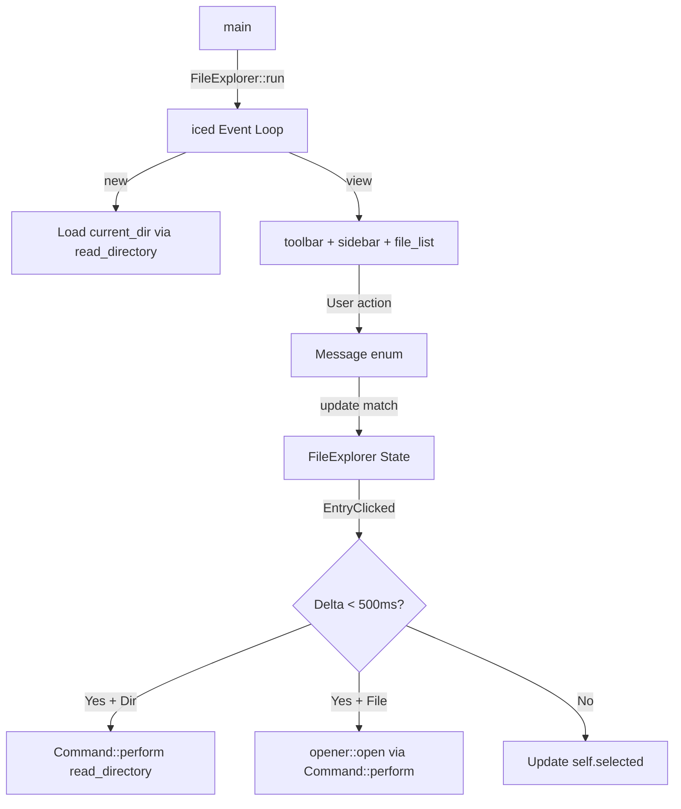

# Developer & Technical Documentation

This document provides a technical guide to the **FileExplorer** application's architecture and execution.

---

## System Architecture

The application follows the iced Elm-architecture pattern: a single `FileExplorer` struct holds all state, a `Message` enum models all events, and the `update` function performs pure state transitions.



---

## Directory Structure & File Roles

```
.
├── src/main.rs             # Application struct, Message enum, and iced trait impl
├── src/app.rs              # Additional application helpers (if present)
├── src/filesystem.rs       # read_directory async function returning Vec<FileEntry>
├── src/ui/toolbar.rs       # Path bar and navigation button widgets
├── src/ui/sidebar.rs       # Sidebar panel widget
├── src/ui/file_list.rs     # File/folder list rendering widget
├── src/ui/mod.rs           # UI module re-exports
├── Cargo.toml              # Dependencies: iced, opener
├── README.md               # General overview
└── Documentation.md        # Technical documentation
```

---

## Workflow

The execution flow of FileExplorer:
1. **Initialization**: `new()` calls `std::env::current_dir()` as the starting path. It immediately dispatches `Command::perform(read_directory(path), Message::DirectoryLoaded)`.
2. **Rendering**: `view` composes a `column!` of `toolbar` on top and a `row!` of `sidebar` + `file_list` below, all driven by the current `self.entries`.
3. **Click Handling**: `EntryClicked` stores the `Instant::now()` and the clicked `PathBuf` in `self.last_click_time` / `self.selected`. On the next click of the same path, if `duration_since(last_time)` is under 500ms, a double-click action fires.
4. **Navigation**: `GoUp` takes `self.current_path.parent()` and dispatches a new directory load. `PathSubmitted` does the same from the text input string.

---

## Launcher Compilation Guide

### Compilation or Execution Commands

```powershell
# Run in development mode
cargo run

# Build an optimized release binary
cargo build --release
./target/release/file_explorer
```
